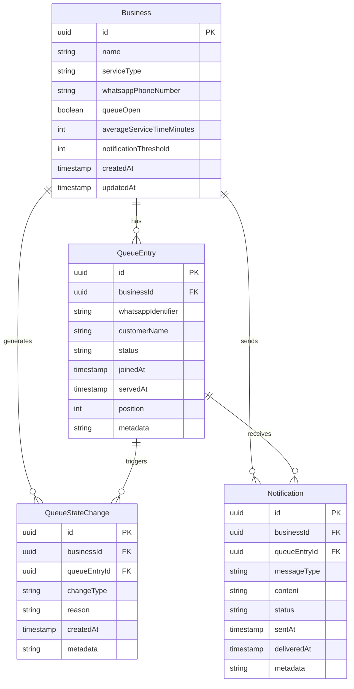

# Data Model: WhatsApp Virtual Queue

**Feature**: WhatsApp Virtual Queue (MVP)  
**Date**: 2026-01-27  
**Database**: PostgreSQL with Redis caching layer

## Entity Relationships



## Entity Definitions

### Business

Represents a service business using the queue system.

**Table**: `businesses`

**Fields**:
- `id` (UUID, PK): Unique identifier
- `name` (VARCHAR(255), NOT NULL): Business display name
- `service_type` (VARCHAR(100), NOT NULL): Type of service (e.g., "Restaurant", "Clinic")
- `whatsapp_phone_number` (VARCHAR(20), UNIQUE, NOT NULL): WhatsApp number for customer interactions
- `queue_open` (BOOLEAN, DEFAULT true): Whether new customers can join
- `average_service_time_minutes` (INTEGER, DEFAULT 10): Average time to serve one customer
- `notification_threshold` (INTEGER, DEFAULT 3): Send "nearly your turn" when within N positions
- `created_at` (TIMESTAMP, DEFAULT NOW): Record creation timestamp
- `updated_at` (TIMESTAMP, DEFAULT NOW): Last update timestamp

**Validation Rules**:
- WhatsApp number must be valid international format
- Average service time must be between 1 and 120 minutes
- Notification threshold must be between 1 and 10

### QueueEntry

Represents a customer's position in a business queue.

**Table**: `queue_entries`

**Fields**:
- `id` (UUID, PK): Unique identifier
- `business_id` (UUID, FK): Reference to business
- `whatsapp_identifier` (VARCHAR(255), NOT NULL): Customer's WhatsApp identifier
- `customer_name` (VARCHAR(255), OPTIONAL): Customer display name
- `status` (VARCHAR(20), NOT NULL): Current status (ACTIVE, SERVED, NO_SHOW, LEFT)
- `joined_at` (TIMESTAMP, DEFAULT NOW): When customer joined queue
- `served_at` (TIMESTAMP, OPTIONAL): When customer was served
- `position` (INTEGER, CALCULATED): Current position in active queue
- `metadata` (JSONB, OPTIONAL): Additional customer data

**Validation Rules**:
- WhatsApp identifier + business_id must be unique for ACTIVE entries
- Status transitions must follow business rules
- Position is calculated based on join time and status

**Status Flow**:
```
ACTIVE -> SERVED (when served)
ACTIVE -> NO_SHOW (when marked no-show)
ACTIVE -> LEFT (when customer leaves)
```

### QueueStateChange

Audit trail of all queue state changes for business intelligence and troubleshooting.

**Table**: `queue_state_changes`

**Fields**:
- `id` (UUID, PK): Unique identifier
- `business_id` (UUID, FK): Reference to business
- `queue_entry_id` (UUID, FK, OPTIONAL): Related queue entry (if applicable)
- `change_type` (VARCHAR(50), NOT NULL): Type of change (CUSTOMER_JOINED, CUSTOMER_SERVED, QUEUE_ADVANCED, etc.)
- `reason` (VARCHAR(255), OPTIONAL): Human-readable reason
- `created_at` (TIMESTAMP, DEFAULT NOW): When change occurred
- `metadata` (JSONB, OPTIONAL): Additional change context

**Change Types**:
- `CUSTOMER_JOINED`: New customer joined queue
- `CUSTOMER_LEFT`: Customer voluntarily left
- `CUSTOMER_SERVED`: Customer was served
- `CUSTOMER_NO_SHOW`: Customer marked as no-show
- `QUEUE_ADVANCED`: Business advanced queue
- `QUEUE_OPENED`: Business opened queue
- `QUEUE_CLOSED`: Business closed queue

### Notification

Record of all outbound WhatsApp messages sent to customers.

**Table**: `notifications`

**Fields**:
- `id` (UUID, PK): Unique identifier
- `business_id` (UUID, FK): Reference to business
- `queue_entry_id` (UUID, FK): Related queue entry
- `message_type` (VARCHAR(50), NOT NULL): Type of message
- `content` (TEXT, NOT NULL): Message content sent
- `status` (VARCHAR(20), NOT NULL): Delivery status (PENDING, SENT, DELIVERED, FAILED)
- `sent_at` (TIMESTAMP, DEFAULT NOW): When message was sent
- `delivered_at` (TIMESTAMP, OPTIONAL): When message was delivered
- `metadata` (JSONB, OPTIONAL): WhatsApp API response data

**Message Types**:
- `JOIN_CONFIRMATION`: Customer joined successfully
- `POSITION_UPDATE`: Position changed due to queue advancement
- `NEARLY_YOUR_TURN`: Within threshold positions
- `YOU_ARE_NEXT`: Currently being served
- `LEAVE_CONFIRMATION`: Customer left successfully
- `QUEUE_CLOSED`: Queue is closed to new entries

## Redis Data Structures

### Queue State Caching

**Key Pattern**: `queue:{businessId}:active`

**Type**: Sorted Set (ZSET)

**Score**: Join timestamp (for FIFO ordering)

**Value**: Queue entry ID

**Operations**:
- `ZADD queue:{businessId}:active {timestamp} {entryId}` - Add customer
- `ZREM queue:{businessId}:active {entryId}` - Remove customer
- `ZRANK queue:{businessId}:active {entryId}` - Get position (0-based)
- `ZCARD queue:{businessId}:active` - Get queue size
- `ZRANGE queue:{businessId}:active 0 -1` - Get all active entries

### Customer Position Cache

**Key Pattern**: `position:{businessId}:{entryId}`

**Type**: String

**Value**: Current position number (1-based)

**TTL**: 1 hour (refreshed on access)

### Business Configuration Cache

**Key Pattern**: `config:{businessId}`

**Type**: Hash

**Fields**:
- `queueOpen`: Boolean
- `averageServiceTime`: Integer (minutes)
- `notificationThreshold`: Integer
- `lastUpdated`: Timestamp

## Database Indexes

### PostgreSQL Indexes

```sql
-- Business lookup by WhatsApp number
CREATE INDEX idx_businesses_whatsapp_phone_number ON businesses(whatsapp_phone_number);

-- Queue entry lookups
CREATE INDEX idx_queue_entries_business_id ON queue_entries(business_id);
CREATE INDEX idx_queue_entries_status ON queue_entries(status);
CREATE INDEX idx_queue_entries_business_status ON queue_entries(business_id, status);
CREATE INDEX idx_queue_entries_joined_at ON queue_entries(joined_at);

-- Unique constraint for active entries
CREATE UNIQUE INDEX idx_queue_entries_active_unique ON queue_entries(business_id, whatsapp_identifier) 
WHERE status = 'ACTIVE';

-- Audit trail queries
CREATE INDEX idx_queue_state_changes_business_id ON queue_state_changes(business_id);
CREATE INDEX idx_queue_state_changes_created_at ON queue_state_changes(created_at);
CREATE INDEX idx_queue_state_changes_type ON queue_state_changes(change_type);

-- Notification queries
CREATE INDEX idx_notifications_business_id ON notifications(business_id);
CREATE INDEX idx_notifications_queue_entry_id ON notifications(queue_entry_id);
CREATE INDEX idx_notifications_status ON notifications(status);
```

## Data Validation Rules

### Business Rules

1. **FIFO Ordering**: Active queue entries are ordered by join timestamp
2. **Single Active Entry**: Customer can only have one ACTIVE entry per business
3. **Queue State**: Queue must be open for new entries to join
4. **Position Calculation**: Position = rank in sorted set + 1 (1-based indexing)

### Notification Rules

1. **Join Confirmation**: Always sent when customer successfully joins
2. **Position Updates**: Sent when customer's position changes
3. **Nearly Your Turn**: Sent when position ≤ notification_threshold
4. **You Are Next**: Sent when position = 1
5. **Rate Limiting**: Maximum 1 message per customer per 30 seconds (except critical updates)

### State Transition Rules

1. **ACTIVE → SERVED**: Only when business marks as served
2. **ACTIVE → NO_SHOW**: Only when business marks as no-show
3. **ACTIVE → LEFT**: Only when customer requests to leave
4. **SERVED/NO_SHOW/LEFT**: Terminal states, no further transitions

## Performance Considerations

### Read Operations
- Queue position lookup: O(log n) from Redis ZRANK
- Business configuration: O(1) from Redis hash
- Queue listing: O(n) from Redis ZRANGE

### Write Operations
- Join queue: O(log n) Redis ZADD + PostgreSQL INSERT
- Leave queue: O(log n) Redis ZREM + PostgreSQL UPDATE
- Advance queue: O(1) Redis operations + batch PostgreSQL updates

### Cache Invalidation
- Business config updates: Invalidate Redis config cache
- Queue state changes: Update Redis sorted set immediately
- Position changes: Update position cache keys

## Migration Strategy

### Initial Setup
1. Create PostgreSQL tables with Liquibase
2. Set up Redis instance
3. Seed initial business data
4. Configure WhatsApp webhook endpoints

### Data Consistency
- Redis as source of truth for active queue state
- PostgreSQL as authoritative audit trail
- Reconciliation job to sync Redis ↔ PostgreSQL if needed
- Health checks to detect data inconsistencies
